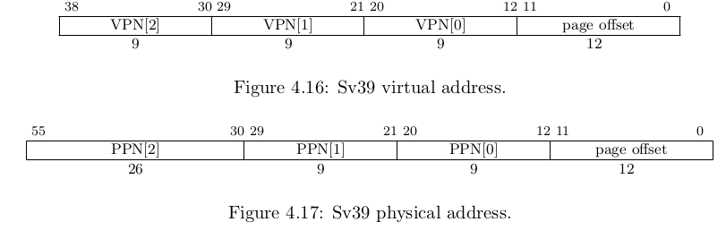
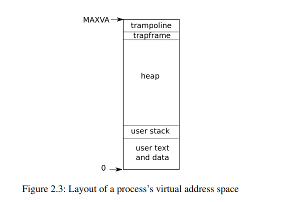

# Virtual Memory

- [Virtual Memory](#virtual-memory)
  - [Voorbereiding](#voorbereiding)
- [GitHub classroom](#github-classroom)
- [Introductie](#introductie)
- [Pagina mappen](#pagina-mappen)
  - [Page table code in xv6](#page-table-code-in-xv6)
- [Scratchpad](#scratchpad)

## Voorbereiding

Ter voorbereiding van deze oefenzitting wordt je verwacht:
  * De oefenzitting system calls te hebben voltooid.
  * Hoofdstuk 3 van het [xv6 boek](https://github.com/besturingssystemen/xv6-riscv) te hebben gelezen.
  * Begrip te hebben van de theorie rond *virtual memory*, *paging* en *page tables*
    * Weten hoe een *virtual address* vertaald kan worden naar een *physical address* via page tables


Onderstaande video kan je bekijken om meer vertrouwd te geraken met het concept paging:

[](https://www.youtube.com/watch?v=JgTXJ-ZV5Zw)

Daarnaast kan je:
* Hoofdstuk 8 in Siblerschatz raadplegen
* De online les over Hoofdstuk 8, deel 3 bekijken op Toledo

# GitHub classroom

**TODO**


# Introductie

**TODO**

# Pagina mappen

Voor we duiken in de code van xv6 willen we eerst verzekeren dat je begrijpt hoe een besturingssysteem ervoor kan zorgen dat een specifiek virtueel adres van een proces gemapt wordt op een fysiek adres in het werkgeheugen.

Herinnner je dat een virtueel adres in een RISC-V processor die het Sv39 schema volgt, 39 bits lang is. xv6 is ontworpen voor dit RISC-V schema.

Onderstaande voorstelling vinden we terug in de [RISC-V privileged specification](https://riscv.org/technical/specifications/):



* Neem een stuk papier en geef antwoord op de volgende vragen.

> :bulb: Op het einde van deze sectie kunnen jullie de antwoorden op deze vragen terugvinden. Dit is echter een zelftest om te kijken of je de concepten goed snapt. Door meteen naar de antwoorden te kijken zal je voor jezelf niet kunnen ontdekken welke delen nog onduidelijk zouden zijn. Indien je begrip van de concepten onvoldoende is zal je waarschijnlijk in de problemen komen bij de permanente evaluatie.


* Wat is het bereik van virtuele adressen in Sv39 (`[minimale adres, maximale adres]`)?

In xv6 worden slechts 38 bits van de 39 bits effectief gebruikt. Het maximale virtuele adres in xv6 wordt `MAXVA` genoemd.

> :bulb: `MAXVA` is eigenlijk het maximale adres + 1. `MAXVA` zelf is dus geen geldig adres.

* Wat is de waarde van `MAXVA`?
* Hoeveel gigabyte werkgeheugen kan dus maximaal geadresseerd worden door een xv6-proces?

> :bulb: Interessant weetje: 32-bit machines waren voor een lange periode de meest voorkomende consumentenmachines. 32-bit machines hebben registers van 32-bit lang. Er werd dus ook meestal gekozen om virtuele adressen 32-bit lang te maken. Je kan nu dus uitrekenen wat het maximaal geheugen is dat processen op dit soort machines konden adresseren (~4gb). Dit bleek voor sommige processen te weinig te zijn, een belangijke reden om van 32-bit naar 64-bit te schakelen.

Stel dat xv6 een nieuw proces inlaadt in het geheugen. Op dat moment moet xv6 de pagina's van dit proces in het fysieke geheugen plaatsen, en vervolgens een virtueel-naar-fysieke mapping opstellen. Deze mapping gebeurt niet willekeurig.
Onderstaande figuur, uit hoofdstuk 2 van het xv6-boek, toont de virtual memory layout van een process.



Een pagina die in de virtuele adresruimte van ieder xv6-proces geladen wordt, is de *trampoline*. 
In deze sessie gaan we in detail bekijken waarom deze pagina daar gemapt staat. 
Op dit moment in de sessie zijn we echter nog niet geinteresseerd in *wat* de trampolinepagina doet, wel in *hoe* de trampolinepagina gemapt wordt.

Neem aan dat:
1. De trampolinepagina in het geheugen gemapt staat in de frame met nummer 1234 (`PPN` = 1234).
2. Het virtuele adres `MAXVA-PGSIZE` moet verwijzen naar de eerste byte van deze trampolinepagina.
   
Je moet nu, als besturingssysteem, ervoor zorgen dat wanneer het nieuwe proces `MAXVA-PGZISE` probeert te dereferencen, de RISC-V hardware dit kan vertalen naar de eerste byte van frame 1234.

* Welke stappen moet xv6 zetten om ervoor te zorgen dat deze adresvertaling correct uitgevoerd wordt?  Neem aan dat de top-level page table reeds bestaat en dat dit de enige page table is die al gealloceerd is voor dit proces.
  * Hoeveel page tables moet het besturingssysteem aanmaken?
  * Welke waarden moeten in deze tables ingevuld worden?

> :bulb: De vraag kan ook zo gesteld worden: hoe kan een besturingssysteem de trampolinepagina mappen op frame 1234?

## Page table code in xv6

De code in xv6 waarmee de page tables aangemaakt worden is helaas weinig illustratief.
Page tables volgen een zeer specifieke structuur waarin elke bit een eigen betekenis heeft, zodat de RISC-V Memory Management Unit (MMU) deze efficiënt in hardware kan doorlopen.

xv6 gebruikt een hoop [C preprocessor](https://en.wikipedia.org/wiki/C_preprocessor) definities om deze page tables correct te initialiseren en bewerken. In de header `kernel/riscv.h` worden vele van deze preprocessor functies gedefinieerd. 
De geïnteresseerden kunnen eens een kijkje nemen in deze header.
We gaan hier verder niet dieper op in.

De code om pagina's te mappen is al illustratiever.

* Bekijk de functie `mappages` in `kernel/vm.c`. De code wordt hieronder uitgeklaard.

Deze functie probeert een bereik van virtuele adressen `[va , va + size - 1]` te mappen op fysische adressen `[pa, pa + size - 1]`.

Merk op dat een adres mappen slechts iets betekent indien je weet voor *welk proces* of welke *virtuele address space* je dit zal doen.
Herinner je dat de adressen voor verschillende processen vertaald worden naar andere fysieke adressen.
Elk proces heeft een eigen *virtual address space*. 
Het `satp`-register wijst hiervoor telkens naar de top-level page table van het huidige proces.
`satp` naar een andere page table laten verwijzen zorgt er dan ook voor dat de volledige adresvertaling anders verloopt.

De eerste parameter van `mappages` is een `pagetable_t`. Deze parameter bevat het fysieke adres van de top-level page table van de *virtual address space* waarin je wil mappen.


Merk ook op dat je niet zomaar één adres kan mappen.
Je mapt altijd één of meerdere pagina's.
Indien `va` dus in het midden van een pagina valt, zal deze volledige pagina gemapt moeten worden.
Daarom wordt `va` aan de start van deze functie met `PGROUNDDOWN` afgerond naar het eerste adres van de pagina waarin `va` valt.

Vervolgens zal de `for`-lus elke pagina in het meegegeven bereik proberen mappen.
In woorden doet de `for`-lus het volgende:
1. Voer een *page table walk* uit om de *page table entry* te zoeken die overeenkomt met de pagina van het virtuele adres.
   * De *page table walk* zal dus drie page tables moeten doorwandelen om de entry te vinden die overeenkomt met de pagina van het virtuele adres.
   * Paginatabellen die nog niet bestonden worden automatisch gealloceerd gedurende de walk.
2. Indien de page table entry al bestond (en *valid* is) wil dit zeggen dat de pagina eerder al gemapt was, mogelijks op een ander fysiek adres. Dit is een kritische fout.  De kernel zal *panic* oproepen, het besturingssysteem stopt. Je kan een virtueel adres uiteraard niet op hetzelfde moment mappen op twee verschillende fysieke adressen.

3. `PA2PTE` wordt gebruikt om het fysieke adres (waarop het virtuele adres gemapt moet worden) om te zetten naar een geldige page table entry. Dit resultaat wordt bewaard in de correcte page table. De pagina is nu gemapt.


Stel dat je de trampolinepagina zou moeten mappen met behulp van de functie `mappages`.

  * Welke waarden zou je toekennen aan de parameters `va` en `size`?

We doen nu een poging de software page-table walk te begrijpen. 

  * Bekijk de functie `walk` in `kernel/vm.c`.

De functie `walk` zoekt de page table entry overeenkomstig met de pagina van het gegeven virtuele adres.
De parameter `alloc` bepaalt wat er moet gebeuren indien een bepaalde page table nog niet bestaat.
Indien `alloc` truthy is zal op dat moment een nieuwe paginatabel gealloceerd worden.

De for-loop zal de drie niveau's van page tables aflopen.
`PX` wordt hierbij gebruikt om de index te vinden in de huidige paginatabel.
Herinner je dat de index uit het virtuele adres gehaald wordt ofwel de eerste, tweede of derde groep van 9 bits te bekijken in het virtuele adres.
Vandaar dus dat `PX` als parameters meekrijgt welke groep bits bekeken moet worden in welk virtueel adres.
Zo kan de correcte page table entry bepaald worden.

In de `else` branch van de for-loop kan je zien hoe een paginatabel wordt aangemaakt.
Elke bit van de frame van de page table wordt eerst op 0 gezet met behulp van `memset`.
Je hebt nu een lege page table.

> :bulb: Een lege page table in RISC-V bestaat enkel uit 0-bits.

Vervolgens moet de verwijzing naar deze nieuwe lege page table nog aan de vorige page table worden toegevoegd.
Dat gebeurt door het fysieke adres van de zonet gealloceerde page table om te zetten naar een frame-nummer met `PA2PTE`.

In een page table entry wordt naast het frame-nummer ook bijgehouden of de page table entry effectief geldig is.
Dit gebeurt door een specifieke bit op 1 te zetten. Daardoor wordt de bitwise or-operator `|` gebruikt:

```c
*pte = PA2PTE(pagetable) | PTE_V;
```

> :information_source: Een bitwise OR-operatie kan gebruikt worden om specifieke bits van een binair getal op `1` te zetten. Neem een willekeurig binair getal `b` van 10 bits lang. Stel dat we bit 2 en bit 4 (geteld van rechts naar links) van dit getal op `1` willen zetten. We stellen nu het volgende binaire getal op: `0000001010`. Hierin staat dus een `1` op positie 2 en 4. Overtuig jezelf dat de bitwise OR-operatie `b | 0000001010` ervoor zorgt dat de 2de en 4de bit van `b` op `1` worden gezet, zonder de waarde van de andere bits te wijzigen.

Je kan meteen ook zien dat dezelfde valid-bit gebruikt wordt in de page table walk.
Wanneer de locatie van een specifieke page table entry gevonden is, zal bekeken worden of deze entry effectief valid is.
Dit gebeurt met behulp van de bitwise and-operator `&`: 

```c
if(*pte & PTE_V)
```

> :information_source: Een bitwise AND-operatie kan gebruikt worden om te controleren of een bepaalde bit van een binair getal `1` is. Stel dat we willen controleren dat bit 2  (geteld van rechts naar links) van een willekeurig binair getal `b` op `1` staat. We stellen nu het volgende binaire getal op: `0000000010` (`1` op positie 2 en 4). Overtuig jezelf dat indien `b & 0000000010` niet gelijk is aan `0`, `b` een `1` heeft op positie 2.

We hebben nu een zicht op hoe page tables gemapt worden in de code van xv6.
Tijd om te kijken hoe dit alles gebruikt wordt.


# Scratchpad

* Process lifecycle revisit
  * Fork
  * Exec
  * Sbrk
    * **Oefening** oef 2 uit xv6 boek H3: sbrk(1)

* Praten over speciale mappings
  * Trampoline (many to one)
  * Null pointer exception (no mapping)
    * **Oefening** unmap adres 0 (xv6 H3 ex4)
  * Identity mapping van kernel
    * Software page table walk
  * VDSO 
    * **oefening** implement
  * Shared memory

* Praten over security
  * Inter-proces: isolatie
    * Kernel vs user space: eigen page tables
    * Verschillende processen: eigen page tables
      * Reflecteren over oefenzitting 1 permanente evaluatie
  * Intra-proces
    * Accces control binnen proces (RWX)
  * **Oefening**
    * Doel: begrip krijgen over isolation via virtual memory
    * Vaag idee (break isolation)
      * 2 syscalls
        * get physical adress from virtual
        * read physical address
      * Twee processen: secret, attacker
      * Secret bewaart geheime data
      * Secret zoekt physical address van geheime data
      * Secret pipet dit adres naar attacker (lol)
      * Attacker gebruikt read physical address en leest secret

* Permanente evaluatie
  * Idee: mmap variant voor user space?


<!--
## Exec

**TODO** ELF-comments van Job in Slack verwerken

Om `exec` te begrijpen is het belangrijk om eerst te snappen wat we bedoelen wanneer we spreken over een *executable*.
Een executable file of uitvoerbaar bestand bevat de volledige informatie, onder andere de machinecode en data, die nodig is om een bepaald programma uit te voeren.

Executables worden meestal gegenereerd door een *linker*. Met behulp van *compilers* worden broncode-bestanden omgezet in *object files*. De linker neemt als input verschillende object-files, verbindt (linkt) deze met elkaar en genereert vervolgens een executable als output.

In UNIX volgen `executables` het [`ELF`](https://en.wikipedia.org/wiki/Executable_and_Linkable_Format)-formaat.
Onderstaande afbeelding (bron: [Wikipedia](https://en.wikipedia.org/wiki/Executable_and_Linkable_Format#/media/File:ELF_Executable_and_Linkable_Format_diagram_by_Ange_Albertini.png)) illustreert de opbouw van een ELF-bestand:


In `ELF`-bestanden worden programma's opgedeeld in verschillende secties. Enkele veelvoorkende secties:

* `.text` bevat de machinecode van het programma
* `.data` bevat de initiële data die bij opstart van het proces geïnitialiseerd moet worden in het geheugen. Geïnitialiseerde global variables horen in de data-sectie
* `.bss` bevat globale data die niet geïnitialiseerd moet worden. Gedeclareerde maar niet-geïnitialiseerde globals horen in de bss-sectie
* `.rodata` bevat read-only data. Hierin worden vaak gedefinieerde strings geplaatst.
* ...

Elk van deze secties moeten in het geheugen geladen worden om een proces op te starten.
Een *loader* neemt als invoer een ELF-bestand en laadt de verschillende secties in het geheugen.
Een loader zet dus als het ware een programma, beschreven in een ELF-bestand, om in een proces dat kan uitvoeren binnen een besturingssysteem.

Naast secties bevat een ELF-bestand ook een *symbol table*. De symbol table bevat informatie over de inhoud van een ELF-bestand, bijvoorbeeld welke functies gedefinieerd zijn in het ELF-bestand en op welke (relatieve) locatie je deze kan terugvinden.

> :bulb: Een proces is niet hetzelfde als een programma. Beide woorden hebben een verschillende betekenis. Een programma beschouwen is de abstracte voorstelling van een taak die door een machine uitgevoerd kan worden. Een ELF-bestand of executable beschrijft een programma. Een proces bevat een instantie van een programma en kan geïnitialiseerd worden met behulp van een executable. Processen zijn de structuren die het mogelijk maken voor een besturingssysteem om programma's uit te voeren.

### ELF in Linux

Om ELF-bestanden te leren kennen zullen we deze eerst bekijken in onze eigen Linux-omgeving (dus niet in xv6):

* Schrijf een C-programma `hello-world.c` binnen je Linux-omgeving

```c
#include <stdio.h>

int main(){
    printf("Hello, world!\n");
    return 0;
}
```

* Compileer en link het programma met `gcc`

```shell
gcc hello-world.c -o hello-world
```
* Bekijk alle secties in het gegenereerde ELF-bestand met behulp van `readelf`

```shell
readelf -S hello-world
```

* Bekijk alle symbolen in het generereerde ELF-bestand met behulp van `readelf`

```shell
readelf -s hello-world
```

* Bekijk de ELF-header met `readelf`. 
```shell
readelf -h hello-world | less
```

* Gebruik het programma `objdump` om de uitvoerbare ELF-secties met machinecode in hello-world te *disassemblen* (omzetten van machinetaal naar leesbare assembly). Met <kbd>↑</kbd> en <kbd>↓</kbd> kan je scrollen in de `less`-omgeving. Met <kbd>q</kbd> kan je de `less`-omgeving afsluiten.

  
```shell
objdump -d hello-world | less
```

### ELF in xv6

We bekijken nu de ELF-files van xv6. ELF-files van xv6 zijn niet rechtstreeks uit te voeren binnen je Linux-omgeving. De ELF-files zijn namelijk gegenereerd voor de RISC-V ISA en bevatten dus enkel RISC-V instructies. 

De programma's `objdump` en `readelf` zijn in Linux gecompileerd voor de specifieke ISA van je processor. Deze programma's kunnen dus niet rechtstreeks gebruikt worden om de ELF-files van xv6 te bekijken.

In de eerste oefenzitting hebben we een RISC-V compiler geïnstalleerd. In dezelfde package zaten gelukkig ook RISC-V varianten van `objdump` en `readelf`.

* Analyseer de `_helloworld` ELF-file die we in vorige oefenzitting gemaakt hebben met behulp van `riscv64-linux-gnu-readelf`

```shell
riscv64-linux-gnu-readelf -a user/_helloworld | less
```

Merk op dat het aantal secties in de RISC-V ELF verschilt van het aantal secties in de x86-ELF. De compiler en linker beslissen welke secties worden toegevoegd aan een ELF-bestand.

* Disassemble de RISC-V machinecode in `_helloworld` met `riscv64-linux-gnu-objdump` 

```shell
riscv64-linux-gnu-objdump -d user/_helloworld | less
```


### Application Binary Interface (ABI)

> **TODO** Kort ABI's introduceren?

### De `exec` system call

Nadat een proces met behulp van `fork` gekopieerd is, willen we in vele gevallen dat dit proces een andere taak kan uitvoeren.
Hiervoor gebruiken we de system call `exec`.

`exec` neemt als invoer een ELF-bestand en initialiseert de ELF-secties in het werkgeheugen. Exec is dus de loader van UNIX-omgevingen.

Exec is ook verantwoordelijk voor een correcte initialisatie van de registers. Nadat het geheugen en de registers correct geïnitialiseerd worden, wordt het programma gestart door te springen naar het *entry point*. Het entry point wordt gespecifieerd in de header-sectie van een ELF-bestand.


* Zoek het entry point dat gebruikt wordt in xv6-programma's door gebruik te maken van `readelf`

De linker is verantwoordelijk om het entry point van een programma correct te bewaren in een ELF-bestand. De GNU linker [ld](https://ftp.gnu.org/old-gnu/Manuals/ld-2.9.1/html_mono/ld.html#SEC24) die standaard door `gcc` gebruikt wordt, maakt gebruik van de volgende prioriteitenlijst om te bepalen wat er in het entry point bewaard wordt:

    1. the `-e' entry command-line option;
    2. the ENTRY(symbol) command in a linker control script;
    3. the value of the symbol start, if present;
    4. the address of the first byte of the .text section, if present;
    5. The address 0. 

In `xv6` wordt in de `Makefile` de `-e` flag opgegeven met als waarde `main`. De uitvoering van een xv6 executable zal dus starten bij het symbool `main`.

-->