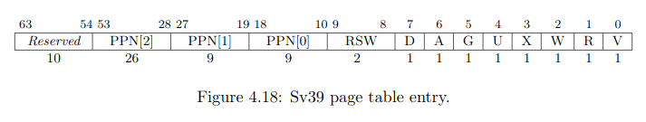
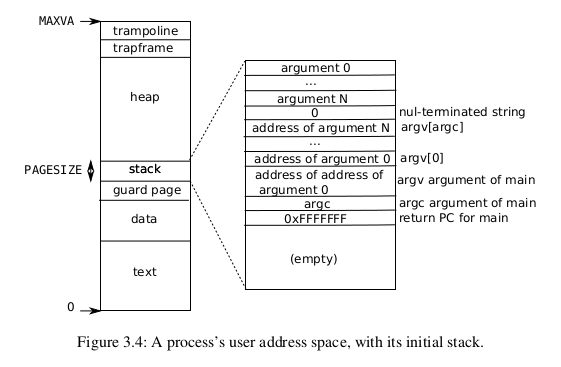

In deze oefenzitting leren jullie over virtual memory.

- [Voorbereiding](#voorbereiding)
- [GitHub classroom](#github-classroom)
- [Introductie](#introductie)
- [Pagina mappen](#pagina-mappen)
  - [Page tables in xv6 en RISC-V](#page-tables-in-xv6-en-risc-v)
  - [Structuur page table](#structuur-page-table)
    - [Bitvoorstellling PTE](#bitvoorstellling-pte)
    - [Access control](#access-control)
    - [Page faults](#page-faults)
- [Address spaces in xv6](#address-spaces-in-xv6)
  - [Kernel address space](#kernel-address-space)
    - [Identity mapping](#identity-mapping)
    - [Kernel stacks](#kernel-stacks)
  - [Process address space](#process-address-space)
    - [Security](#security)
- [Levenscyclus proces](#levenscyclus-proces)
  - [Pagetables inspecteren](#pagetables-inspecteren)
  - [fork en exec](#fork-en-exec)
  - [Proces mappings veiliger maken](#proces-mappings-veiliger-maken)
- [Permanente evaluatie: VDSO](#permanente-evaluatie-vdso)
- [Bonus: Null pointer exception](#bonus-null-pointer-exception)

# Voorbereiding

Ter voorbereiding van deze oefenzitting word je verwacht:
  * De oefenzitting system calls te hebben voltooid.
  * Hoofdstuk 3 van het [xv6 boek](https://github.com/besturingssystemen/xv6-riscv) te hebben gelezen.
  * Begrip te hebben van de theorie rond *virtual memory*, *paging* en *page tables*
    * Weten hoe een *virtual address* vertaald kan worden naar een *physical address* via page tables


Onderstaande video kan je bekijken om meer vertrouwd te geraken met het concept paging:

[](https://www.youtube.com/watch?v=JgTXJ-ZV5Zw)

Daarnaast kan je:
* Hoofdstuk 8 in Siblerschatz raadplegen
* De online les over Hoofdstuk 8, deel 3 bekijken op Toledo

# GitHub classroom

**TODO**


# Introductie

In deze sessie gaan we dieper in op het concept virtual memory.
We kijken hoe paging werkt en hoe dit gebruikt wordt om virtual memory te implementeren.
Vervolgens bekijken we enkele wijdverspreide toepassingen van virtual memory.

# Pagina mappen

Voor we duiken in de code van xv6 willen we eerst verzekeren dat je begrijpt hoe een besturingssysteem ervoor kan zorgen dat een specifiek virtueel adres van een proces gemapt wordt op een fysiek adres in het werkgeheugen.

Herinnner je dat een virtueel adres in een RISC-V processor die het Sv39 schema volgt, 39 bits lang is. xv6 is ontworpen voor dit RISC-V schema.

Onderstaande voorstelling vinden we terug in de [RISC-V privileged specification](https://riscv.org/technical/specifications/):


* Neem een stuk papier en geef antwoord op de volgende vragen.

> :bulb: Op het einde van deze sectie kunnen jullie de antwoorden op deze vragen terugvinden. Dit is echter een zelftest om te kijken of je de concepten goed snapt. Door meteen naar de antwoorden te kijken zal je voor jezelf niet kunnen ontdekken welke delen nog onduidelijk zouden zijn. Indien je begrip van de concepten onvoldoende is zal je waarschijnlijk in de problemen komen bij de permanente evaluatie.


* Wat is het bereik van virtuele adressen in Sv39 (`[minimale adres, maximale adres]`)?

In xv6 worden slechts 38 bits van de 39 bits effectief gebruikt. Het maximale virtuele adres in xv6 wordt `MAXVA` genoemd.

> :bulb: `MAXVA` is eigenlijk het maximale adres + 1. `MAXVA` zelf is dus geen geldig adres.

* Wat is de waarde van `MAXVA`?
* Hoeveel gigabyte werkgeheugen kan dus maximaal geadresseerd worden door een xv6-proces?

> :bulb: Interessant weetje: 32-bit machines waren voor een lange periode de meest voorkomende consumentenmachines. 32-bit machines hebben registers van 32-bit lang. Er werd dus ook meestal gekozen om virtuele adressen 32-bit lang te maken. Je kan nu dus uitrekenen wat het maximaal geheugen is dat processen op dit soort machines konden adresseren (~4gb). Dit bleek voor sommige processen te weinig te zijn, een belangijke reden om van 32-bit naar 64-bit te schakelen.

Stel dat xv6 een nieuw proces inlaadt in het geheugen. Op dat moment moet xv6 de pagina's van dit proces in het fysieke geheugen plaatsen, en vervolgens een virtueel-naar-fysieke mapping opstellen. Deze mapping gebeurt niet willekeurig.
Onderstaande figuur, uit hoofdstuk 2 van het xv6-boek, toont de virtual memory layout van een process.


Een pagina die in de virtuele adresruimte van ieder xv6-proces geladen wordt, is de *trampoline*. 
In een toekomstige sessie gaan we in detail bekijken waarom deze pagina daar gemapt staat.
Vandaag zijn we echter nog niet geinteresseerd in *wat* de trampolinepagina doet, wel in *hoe* de trampolinepagina gemapt wordt.

Neem aan dat:
1. De trampolinepagina in het geheugen gemapt staat in de frame met nummer 1234 (`PPN` = 1234).
2. Het virtuele adres `MAXVA-PGSIZE` (0x3ffffff000) moet verwijzen naar de eerste byte van deze trampolinepagina.
   
Je moet nu, als besturingssysteem, ervoor zorgen dat wanneer het nieuwe proces `MAXVA-PGZISE` probeert te dereferencen, de RISC-V hardware dit kan vertalen naar de eerste byte van frame 1234.

* Welke stappen moet xv6 zetten om ervoor te zorgen dat deze adresvertaling correct uitgevoerd wordt?  Neem aan dat de top-level page table reeds bestaat en dat dit de enige page table is die al gealloceerd is voor dit proces.
  * Hoeveel page tables moet het besturingssysteem aanmaken?
  * Welke waarden moeten in deze tables ingevuld worden?

> :bulb: De vraag kan ook zo gesteld worden: hoe kan een besturingssysteem de trampolinepagina mappen op frame 1234?

> :warning: Indien je na 30 minuten in de oefenziting nog niet klaar bent met deze sectie, roep dan zeker een assistent om je verder te helpen.

## Page tables in xv6 en RISC-V

In xv6 worden pagina's gemapt met behulp van de functie `mappages`.
Dit is de definitie van deze functie:

```c
// Create PTEs for virtual addresses starting at va that refer to
// physical addresses starting at pa. va and size might not
// be page-aligned. Returns 0 on success, -1 if walk() couldn't
// allocate a needed page-table page.
int
mappages(pagetable_t pagetable, uint64 va, uint64 size, uint64 pa, int perm);
```

> :information_source: De implementatie van mappages vergt veel uitleg en leert ons weinig nieuwe informatie. Voor de geïnteresseerden geven we [hier](page-table-code/README.md) deze uitleg. Volg echter eerst de rest van de oefenzitting.


Stel dat je de trampolinepagina zou moeten mappen met behulp van de functie [`mappages`][mappages].

  * Welke waarden zou je toekennen aan de parameters `va` en `size`?

## Structuur page table

Page tables volgen een zeer specifieke structuur waarin elke bit een eigen betekenis heeft, zodat de RISC-V Memory Management Unit (MMU) deze efficiënt in hardware kan doorlopen.

### Bitvoorstellling PTE

Een page table kan je in het geheugen telkens terugvinden in het begin van een frame.
Elke page table bestaat uitsluitend uit 512 page table entries (PTE).
Een page table entry is niets anders dan een lange bitstring (32 bits) waarbij elke bit (of groep van bits) een eigen betekenis heeft.

Beantwoordt de volgende vragen:

* We weten dat een page table 512 entries heeft en we weten dat elke entry 32 bit groot is. Hoe groot is een volledige page table?
* We weten dat we een offset van 12 bit gebruiken om een byte in een frame of pagina te addresseren. Hoe groot zijn pagina's of frames in Sv32?
* We weten dat een page table geplaatst wordt aan de start van een frame. Past een page table in één enkele frame?




Bovenstaande figuur geeft de bit-layout weer van zo'n page table entry.

> :information_source: Zoals je ziet worden bits genummerd van rechts naar links.  [Hier](https://stackoverflow.com/questions/23551187/why-bits-are-numbered-from-right-to-left) kan je een goede verklaring vinden. Dit is een conventie die zo goed als altijd toegepast wordt. De meest rechtse bit wordt ook vaak de LSB (least significant bit) genoemd, aangezien deze bit het minste gewicht heeft. De meest linkse bit wordt vaak de MSB (most significant bit) genoemd, deze heeft het meeste gewicht. 

Laten we de verschillende bits van een page table entry verder bespreken:

* `PPN`: Bits 10 - 31 zijn de 21 bits die naar een frame verwijzen. Ze bevatten dus het frame nummer (*physical page number*, PPN)
* `U`: Bit 4 is de user bit. Een pagina kan enkel in user-mode gebruikt worden indien de `U`-bit actief is.
* `X`: Bit 3 is de executable bit. Indien een pagina code bevat kan deze enkel uitgevoerd worden indien de `X`-bit van deze pagina actief is.
* `W`: Bit 2 is de writeable bit. Data kan enkel naar een pagina geschreven worden indien `W` actief is.
* `R`: Bit 1 is de readable bit. Data kan enkel van een pagina gelezen worden indien `R` actief is.
* `V`: Bit 0 is de valid bit. Enkel indien deze bit actief is, wordt de gehele page table entry als geldig beschouwd. Alle voorgaande bits hebben enkel een betekenis indien `V` actief is. Om een pagina te *unmappen* is het dus voldoende om `V` op 0 te zetten.

> :information_source: Enkele minder relevante bits voor de geïnteresseerden: 
> * `RSW`: Bits 8 - 9 mogen door een besturingssysteem gebruikt worden op een manier naar keuze. Ze worden door de MMU genegeerd. xv6 gebruikt deze bits niet.
> * `D`, `A`: Bit 7 is de dirty bit, bit 6 de accessed bit. De dirty bit houdt bij of een pagina gelezen, geschreven of opgehaald werd sinds de laatste keer dat de accesed bit op 0 werd gezet. Deze bits worden gebruikt om het cachen en swappen van pagina's efficiënter te laten verlopen. Voor meer infomatie verwijzen we jullie naar Silberschatz (8.4.1 Basic Page Replacement of zoek in je termen-index naar de dirty bit).
> * `G`: Bit 5 is de *global mapping* bit. Page tables worden per proces gealloceerd. Het is echter mogelijk om bepaalde page tables te delen tussen *alle* processen. Indien je de `G` bit in dat geval actief maakt kan de processor betere performantie leveren. Deze page tables zou je bijvoorbeeld permanent in een cache geladen kunnen houden.

### Access control

Bij de bespreking van de bitvoorstelling van een page table entry is duidelijk geworden dat paging niet uitsluitend gebruikt wordt om adressen te vertalen.
Het vertalingsproces wordt ook gebruikt om aan access control te doen.

Zo kan de kernel bepaalde pagina's ontoegankelijk maken voor een user-space proces, door de `U`-bit op 0 (inactief) te zetten.
Pagina's kunnen read-only gemaakt worden door `R` te activeren en `W` en `X` te deactiveren.

Onderstaande figuur geeft enkele mogelijke combinaties van `R`, `W` en `X` en hun betekenis:


### Page faults

Wanneer we een virtueel adres of pagina aanspreken en ons niet houden aan de access control regels geëncodeerd in de page table entry, treedt een *page fault exception* op.

Een *exception* in hardware zorgt ervoor dat de huidige programma-executie onderbroken wordt.
De processor switcht van modus en springt naar een vast adres in de code van de kernel.
De code op dit adres noemen we de *trap handler*.

> :information_source: Merk op dat ook de `ecall`-instructie uit vorige oefenzitting ervoor zorgde dat er naar de *trap handler* gesprongen werd. Daarnaast is het ook mogelijk dat naar de trap handler gesprongen wordt als gevolg van een interrupt. De trap handler moet dus bepalen wat de reden is van de trap.

De meesten van jullie zullen onbewust al een exception hebben veroorzaakt, door een bug in jullie code.
xv6 zal in dat geval het falende proces meteen beëindigen.
Vervolgens print xv6, via de trap handler, de reden van de exception.
Hier enkele mogelijkheden:

> :information_source: De onderstaande tabel is enkel geldig indien een exception optreedt die in supervisor mode kan worden afgehandeld. Sommige exceptions worden afgehandeld in machine mode, daarvoor kan je een andere tabel vinden in de [RISC-V specificaties](https://riscv.org/technical/specifications/).


Denk nu terug aan de eerste oefenzitting. 
Je schreef een hello world programma met een simpele return uit main.
`crt0` was nog niet toegevoegd, dus de `jr ra` instructie sprong naar een waarde in `ra` die nergens geïnitialiseerd was.
Stel dat je springt naar een willekeurig adres in de virtuele adresruimte van je proces.

  * Welke excepties uit bovenstaande tabel kunnen optreden? Merk op dat page faults niet de enige vorm van exceptions zijn.

**TODO** Oefening die fault veroorzaakt hier?

Page faults kunnen ten slotte dus ook optreden op het moment dat de MMU een virtueel adres probeert te vertalen maar een bepaalde page table entry niet gevonden wordt.
De pagina is op dat moment dus niet gemapt.
Het besturingssysteem zou op dat moment kunnen beslissen om alsnog een pagina te mappen (zie *demand paging* in je boek).

# Address spaces in xv6

Genoeg over page tables.
Laten we eens op een hoger niveau kijken hoe dit alles door xv6 gebruikt wordt om aan de kernel en processen eigen adresruimten toe te kennen.

## Kernel address space

In hoofdstuk 3 van het xv6 boek kwamen we de volgende figuur tegen:


De functie [`kvmmake`][kvmmake] roept `mappages` op (via `kvmmap`) om de address space van de kernel op te bouwen.

* Bekijk de functie [`kvmmake`][kvmmake]. Deze code zou ondertussen begrijpbaar moeten zijn.

Dankzij `kvmmake` zijn de page tables van de kernel geïnitialiseerd zodat de virtuele adresruimte van de kernel bovenstaande structuur volgt.
Op het moment dat code in de kernel uitvoert, wijst het `satp`-register naar de top-level page table van de kernel.
Hierdoor worden adressen vertaald zoals afgebeeld.

Zo zie je dat de code (`text`-sectie) van de kernel ingeladen is op adres `0x80000000`.
De pagina's met code zijn gemapt als read/execute.
Net boven de code wordt de `data`-sectie (globale variabelen) van de kernel gemapt.

### Identity mapping

De mapping van de kernel heeft een speciale structuur.
De kernel code en data volgen een identity mapping.
Elk fysisch adres wordt gemapt op hetzelfde overeenkomstige virtueel adres.
Hiermee bedoelen we: virtueel adres `0x80000000` wordt gemapt op fysisch adres `0x80000000`.
Virtueel adres `0x80000001` wordt gemapt of fysisch adres `0x80000001`, enzovoort.

Er is een belangrijke reden om deze mapping op deze manier uit te voeren.
De code om paginatabellen te bewerken bevindt zich in de text section van de kernel.
Deze code moet voortdurend kunnen schrijven naar fysieke adressen.
Door de identity map werk je in feite rechtstreeks met fysieke adressen, waardoor page table code veel eenvoudiger geschreven kan worden.
De code die page tables bewerkt in xv6 zou niet werken zonder deze identity map.

### Kernel stacks

De kernel reserveert voor ieder proces een eigen *kernel stack*
Deze stack wordt gebruikt als *call stack* op het moment dat een proces switcht naar supervisor-mode, bijvoorbeeld als gevolg van een `ecall` of een *exception*.

Tussen elke kernel stack vind je een *guard page*.
Dit is meteen een interessante toepassing van virtual memory.
De grootte van de process kernel stack wordt door xv6 gelimiteerd tot 1 pagina.
Indien een stack groter wordt dan het gealloceerde geheugen spreken we over een *stack overflow*.
Zonder bescherming tegen een *stack overflow* zou dit ervoor kunnen zorgen dat de stack kritische kerneldata overschrijft.

Om te detecteren wanneer een xv6 kernel stack vol is, wordt de pagina boven de stack niet gemapt.
Wanneer je probeert te schrijven naar een unmapped pagina krijg je een page fault.
Op die manier kan een stack overflow automatisch gedetecteerd en vermeden worden.

## Process address space

Op het moment dat een proces in user-mode uitvoert zorgt de kernel ervoor dat het `satp`-register wijst naar de top-level page table van het huidige proces.
Elk proces heeft zo een eigen virtuele adresruimte.

Ook voor processen kiest xv6 een vaste layout om deze adresruimte op te delen:



Ieder proces krijgt een eigen pagina gealloceerd om de *call stack* van het programma in te bewaren.
Onder deze stackpagina wordt, net zoals in de kernel, een guard pagina geplaatst die niet gemapt wordt in het geheugen, zodat stack overflows gededecteerd kunnen worden.

De code van een proces wordt in xv6 gemapt op virtueel adres 0, dus op de eerste pagina in de virtuele adresruimte.
Deze code kan één of meerdere pagina's groot zijn.
Boven de code (op hogere addressen) wordt de global data van het proces gemapt.

### Security

Indien een user-space proces zou kunnen schrijven naar het geheugen van de kernel, zou dit rampzalig zijn.
Eender welk onschuldig, geïnstalleerd programma zou je besturingssysteem kunnen aanpassen en vervolgens je volledige machine kunnen overnemen.

Het zou voldoende zijn om eigen code te schrijven naar een pagina van de kernel, vervolgens `ecall` uit te voeren (waardoor de processor naar supervisor mode switcht) en ervoor te zorgen dat de trap handler jouw nieuwe code uitvoert in plaats van de oude kernel code.
Op dat moment wordt je code uitgevoerd met de volle rechten van het OS. Het onschuldige programma heeft dus volledige controle over alles wat er verder gebeurt op jouw machine.

Virtual memory zorgt ervoor dat je geen toegang hebt tot het geheugen van de kernel.
Virtual memory zorgt er ook voor dat je geen toegang hebt tot het geheugen van andere processen.
Zo kan je browser niet aan de inhoud van je password manager, enzovoort.

# Levenscyclus proces

In deze sectie gaan we dieper in op de impact van `fork`, `exec` en `sbrk` op de geheugenmappings van een proces.

## Pagetables inspecteren

Om het gemakkelijk te maken de pagetables van processen te bekijken, hebben we een syscall toegevoegd: [`vmprintmappings`][sys_vmprintmappings].
Deze syscall zal alle geldige mappings van het oproepende proces afprinten in het volgende formaat:

<pre>
{va} -> {pa}, mode={U|S}, perms={r|-}{w|-}{x|-}
</pre>

Hier is `va` het virtuele adres van een page, `pa` het fysieke adres vet het overeenkomende frame.
`mode` is `U` voor een user page of `S` voor een supervisor (kernel) page.
`perms` toont de permissie flags voor de pagina: readable (`r`), writable (`w`), en executable (`x`).
Elk veldje bevat een `-` als de permissie niet gezet is.

De implementatie van `vmprintmappings` vind je in [`vm.c`][sys_vmprintmappings impl].
Alhoewel je zeker niet elk detail hoeft te begrijpen, is het nuttig om de implementatie eens te bekijken.

- Roep `vmprintmappings` in je hello world programma en vergelijk het resultaat met figuur 3.4 in het xv6 boek.
  Probeer elke mapping te begrijpen en kijk zeker naar de `mode` en `perms` velden.
- Maak een programma dat `vmprintmappings` oproept voor en na een oproep naar `sbrk(1)`.
  Verklaar het verschil in de outputs.

## fork en exec

In de [sessie over os interfaces](https://github.com/besturingssystemen/os-interfaces) hebben jullie in de permanente evaluatie ontdekt dat wanneer een proces geforked wordt, je plots twee processen hebt met *dezelfde* adressen maar toch mogelijks andere waarden op deze adressen.

* Verklaar dit aan de hand van je kennis over virtual memory
* Maak een programma dat `fork` gebruikt om een child proces te maken en vervolgens `vmprintmappings` oproept in parent en child.
  Verklaar de output.
  (Hint: gebruik `wait` in de parent om te wachten tot het child klaar is met uitvoeren om te voorkomen dat de outputs van `vmprintmappings` door elkaar geprint worden.)
* Bekijk nu het effect van `exec` op de mappings.
  Roep `vmprintmappings` voor de oproep naar `exec` en ook in het programma dat je met `exec` uitvoert.

> :information_source: Geïnteresseerden kunnen [hier](fork/README.md) een uitgebreide uitleg vinden over de xv6 implementatie van fork.


## Proces mappings veiliger maken

In sectie 3.8 van het xv6 boek wordt uitgelegd hoe `exec` secties uit een ELF file in het geheugen laadt via [`uvmalloc`][uvmalloc]. 

> :information_source: Een gedetailleerde uitleg over exec/ELF kan je ook [hier](exec/README.md) terugvinden.


We gaan dit nu wat meer in detail bekijken via het volgende programma (in `hello.c`):

```c
#include "user/user.h"

int message_id = 42;
const char* message = "Hello, world";

void print_message()
{
  printf("[%d] %s\n", message_id, message);
}

int main()
{
  vmprintmappings();

  print_message();

  return 0;
}
```

Laten we eens kijken wat de secties zijn in het gecompileerde ELF bestand:
<pre>
$ readelf -l user/_hello

Elf file type is EXEC (Executable file)
Entry point 0x83a
There are 2 program headers, starting at offset 64

Program Headers:
  Type           Offset             VirtAddr           PhysAddr
                 FileSiz            MemSiz              Flags  Align
  LOAD           0x0000000000001000 0x0000000000000000 0x0000000000000000
                 0x000000000000089a 0x000000000000089a  R E    0x1000
  LOAD           0x0000000000002000 0x0000000000001000 0x0000000000001000
                 0x000000000000000c 0x0000000000000028  RW     0x1000

 Section to Segment mapping:
  Segment Sections...
   00     .text .rodata
   01     .sdata .sbss .bss
</pre>

Je kan zien dat er twee secties zijn die in het geheugen geladen moeten worden (type `LOAD`):
- Op virtueel adres 0x0 (`VirtAddr`), een sectie die 0x89a bytes groot is in het geheugen (`MemSiz`).
  De permissies op deze sectie (`Flags`) zijn read (`R`) en execute (`E`).
  Dit is de sectie die de code en constantes zoals string literals bevat.
- Op virtueel adres 0x1000, een read-write (`RW`) sectie die 0x28 bytes groot is.
  Dit is de data sectie die globale variabelen bevat.

En laten we dan eens kijken hoe deze executable in het geheugen geladen wordt:
<pre>
$ make qemu
...
$ hello
0x0000000000000000 -> 0x0000000087f43000, mode=U, perms=rwx
0x0000000000001000 -> 0x0000000087f40000, mode=U, perms=rwx
0x0000000000002000 -> 0x0000000087f3f000, mode=S, perms=rwx
0x0000000000003000 -> 0x0000000087f3e000, mode=U, perms=rwx
0x0000003fffffe000 -> 0x0000000087f76000, mode=S, perms=rw-
0x0000003ffffff000 -> 0x0000000080007000, mode=S, perms=r-x
[42] Hello, world
</pre>

De eerste twee pagina's komen overeen met de twee secties in het ELF bestand.
Echter, de permissies komen _niet_ overeen!
Beide pagina's hebben volledige read-write-execute rechten.

Alhoewel dit werkt, is het niet optimaal vanuit een security oogpunt.
Zo is het bijvoorbeeld mogelijk om de code te overschrijven, iets wat bij de meeste programma's niet de bedoeling is en meestal wijst op een bug.
Om dit eens uit te testen, kan je het volgende stukje code toevoegen _voor_ de oproep van `print_message`:
```c
*(uint16*)print_message = 0x8082;
```

Deze code zal de waarde `0x8082` (de hexadecimale voorstelling van de `jr ra` (`ret`) instructie in RISC-V) naar het adres van de `print_message` functie schrijven.
Het resultaat is dus dat de functie meteen returnt zonder het bericht af te printen.
Op de meeste besturingssystemen zal dit niet werken en zal het programma crashen door een _segmentation fault_ (of iets gelijkaardigs).
Je kan dit eens proberen op Linux bijvoorbeeld.
Aangezien de code in xv6 writable gemapt is, gaat dit daar _wel_ werken.
Controleer dit door het aangepaste programma uit te voeren.

Om dit probleem op te lossen, zullen we de [`exec`][exec] functie aan moeten passen.
In de [lus die de ELF secties laadt][exec load loop], wordt [`uvmalloc`][uvmalloc] opgeroepen om voor elke sectie de nodige mappings toe te voegen.
Het probleem is dat `uvmalloc` elke sectie als `rwx` mapt.
We gaan dus code toevoegen om de flags van een mapping aan te passen en gelijk te stellen aan de flags van de overeenkomstige ELF sectie.

- Implementeer de volgende functie in `vm.c`:
  ```c
  void vmsetflags(pagetable_t pagetable, uint64 va, uint64 len, uint flags)
  ```
  Deze functie moeten voor alle pagina's in het interval `[va, va + len)` de flags van de PTE op `flags` zetten.
    - Gebruik [`walk`][walk] om de PTE voor een virtueel adres te krijgen.
    - De constante [`PTE_FLAGS_MASK`][PTE_FLAGS_MASK] kan gebruikt worden om de flag bits in een PTE te masken.
      Je kan de volgende code gebruiken om de flags te overschrijven (hoe werkt dit?):
      ```c
      *pte &= ~PTE_FLAGS_MASK;
      *pte |= (flags & PTE_FLAGS_MASK);
      ```
- Roep `vmsetflags` op in `exec` na het laden van elke sectie.
  Om de juiste flags mee te geven, moet je de ELF flags (in [`struct proghdr`][struct proghdr]) vertalen naar de juiste PTE flags.
  Gebruik hiervoor de [constanten][ELF flags consts] gedefinieerd in [`elf.h`][elf.h].
  Vergeet zeker niet de `PTE_V` en `PTE_U` flags te zetten!

Verifieer je implementatie via de `vmprintmappings` syscall.


# Permanente evaluatie: VDSO

**TODO** VDSO


# Bonus: Null pointer exception

* Compileer en voer in je Linuxdistributie (niet in xv6) het volgende simpele programma uit:

```c
#include <stdio.h> //#include "user/user.h" in xv6! 
int main(){
  int *p = 0; //p is a pointer to the address 0
  printf("The value at address 0 is %d", *p);
  return 0;
}
```

* Wat is de output van je programma? *(hint: een welbekende foutmelding)*
* Compileer nu hetzelfde programma in xv6 en voer dit uit. Wat is daar je output?

De fout die we krijgen in onze eigen Linuxdistributie krijgen we niet in xv6.
Tijd om eens na te denken over wat bovenstaande code net doet.
In feite niet veel meer dan het adres 0 uitlezen.

In de meeste Linux-distributies wordt het adres 0 gebruikt om aan te geven dat een pointer nergens naar verwijst, of niet geïnitialiseerd is.
Denk bijvoorbeeld aan een simpele linked list.
Indien het *next* veld van een lijstelement 0 is, hebben we het laatste element van de lijst bereikt.
Kortom, het is niet de bedoeling dat er nuttige informatie op adres 0 te vinden is.

Het lezen van informatie uit adres 0 wijst dus bijna zeker op een fout in je code.
Om ervoor te zorgen dat deze fouten gedetecteerd kunnen worden, zullen Linux-distributies ervoor zorgen dat het adres 0 ontoegankelijk is.

xv6 doet dit echter niet. In xv6 staat er code op adres 0. Adres 0 is gewoon toegankelijk. Dat is in feite een zeer slechte beslissing, want zo is het veel lastiger fouten te vinden in C-code (in plaats van een exception krijg je willekeurge data, waarschijnlijk de bytecode van een functie, bij het uitlezen van adres 0).

* **Bonusoefening (moeilijk):** Pas xv6 aan zodat je een exception krijgt wanneer het adres 0 wordt gedereferenced.

> :information_source: Gebruik het forum voor hulp!


[vm]: https://github.com/besturingssystemen/xv6-riscv/blob/d4cecb269f2acc61cc1adc11fec2aa690b9c553b/kernel/vm.c
[mappages]: https://github.com/besturingssystemen/xv6-riscv/blob/d4cecb269f2acc61cc1adc11fec2aa690b9c553b/kernel/vm.c#L138
[walk]: https://github.com/besturingssystemen/xv6-riscv/blob/d4cecb269f2acc61cc1adc11fec2aa690b9c553b/kernel/vm.c#L81
[riscv]: https://github.com/besturingssystemen/xv6-riscv/blob/d9160fb4b98e3ce04d3928c1fbd2ec26b3cc746a/kernel/riscv.h#L323
[proc]: https://github.com/besturingssystemen/xv6-riscv/blob/2821d43cc95b4f9faf79ff94daa5d3a8ea5e7861/kernel/proc.c
[fork]: https://github.com/besturingssystemen/xv6-riscv/blob/2821d43cc95b4f9faf79ff94daa5d3a8ea5e7861/kernel/proc.c#L244
[allocproc]: https://github.com/besturingssystemen/xv6-riscv/blob/2821d43cc95b4f9faf79ff94daa5d3a8ea5e7861/kernel/proc.c#L100
[uvmcopy]: https://github.com/besturingssystemen/xv6-riscv/blob/d4cecb269f2acc61cc1adc11fec2aa690b9c553b/kernel/vm.c#L298
[sys_vmprintmappings]: https://github.com/besturingssystemen/xv6-riscv/blob/b26f9c647c1b8d27b7a7b3b374422c87591a8e1a/kernel/sysproc.c#L99
[sys_vmprintmappings impl]: https://github.com/besturingssystemen/xv6-riscv/blob/b26f9c647c1b8d27b7a7b3b374422c87591a8e1a/kernel/vm.c#L433-L460
[kvmmake]: https://github.com/besturingssystemen/xv6-riscv/blob/d4cecb269f2acc61cc1adc11fec2aa690b9c553b/kernel/vm.c#L20
[uvmalloc]: https://github.com/besturingssystemen/xv6-riscv/blob/720a130ceafcc55ec3624b47e8a1368f3f5f00ae/kernel/vm.c#L215
[exec]: https://github.com/besturingssystemen/xv6-riscv/blob/720a130ceafcc55ec3624b47e8a1368f3f5f00ae/kernel/exec.c#L12
[exec load loop]: https://github.com/besturingssystemen/xv6-riscv/blob/720a130ceafcc55ec3624b47e8a1368f3f5f00ae/kernel/exec.c#L41-L59
[PTE_FLAGS_MASK]: https://github.com/besturingssystemen/xv6-riscv/blob/720a130ceafcc55ec3624b47e8a1368f3f5f00ae/kernel/riscv.h#L345
[struct proghdr]: https://github.com/besturingssystemen/xv6-riscv/blob/720a130ceafcc55ec3624b47e8a1368f3f5f00ae/kernel/elf.h#L30
[ELF flags consts]: https://github.com/besturingssystemen/xv6-riscv/blob/720a130ceafcc55ec3624b47e8a1368f3f5f00ae/kernel/elf.h#L44-L47
[elf.h]: https://github.com/besturingssystemen/xv6-riscv/blob/720a130ceafcc55ec3624b47e8a1368f3f5f00ae/kernel/elf.h
[trampoline]: https://github.com/besturingssystemen/xv6-riscv/blob/1f555198d61d1c447e874ae7e5a0868513822023/kernel/trampoline.S